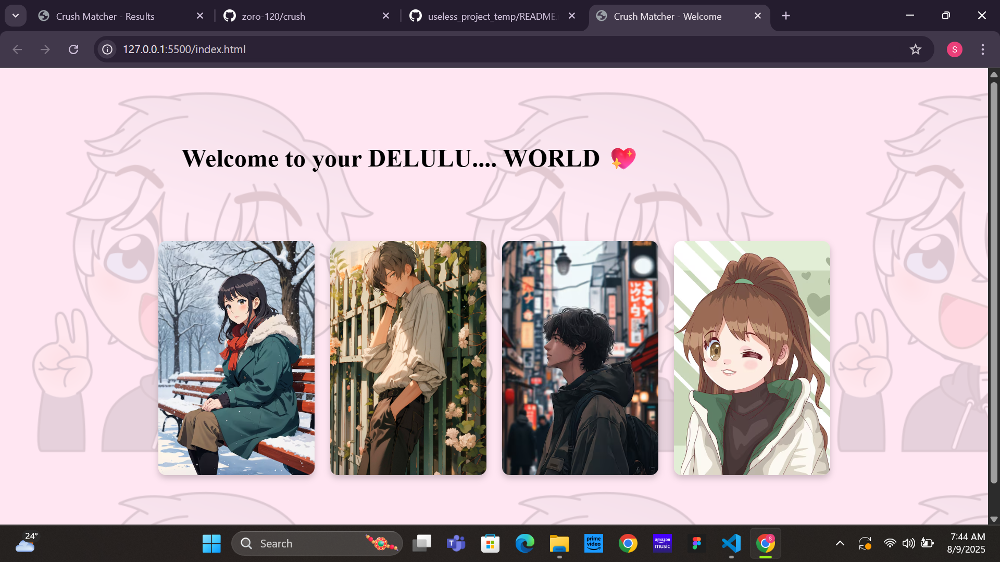
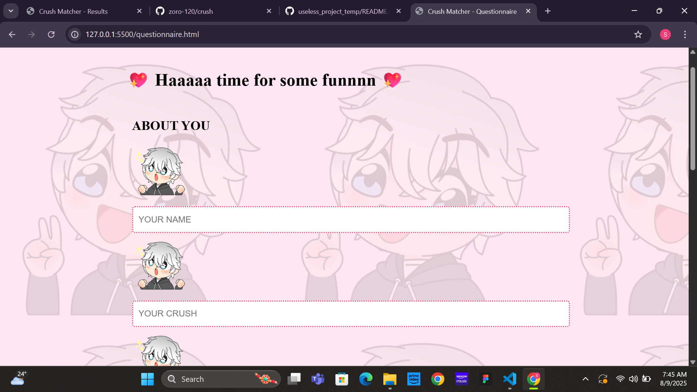
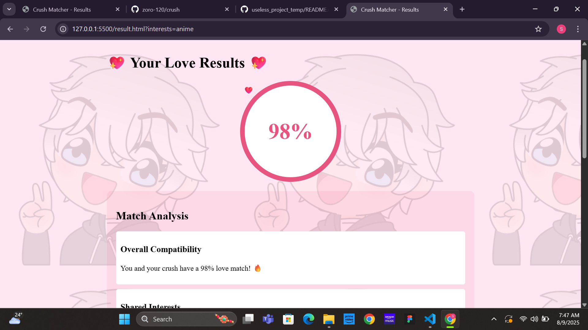

# [CRUSH MATCHER] 🎯

## Basic Details
### Team Name: [Aot]

### Team Members
- Team Lead: [Shamna ck] - [emea college]
- Member 2: [Sana Nasnreen v] - [emea college]
- Member 3: [Name] - [College]

### Project Description
[it is a project about analysing how much we match with person we just gave information about(it is a real random percentage)]

### The Problem (that doesn't exist)
[just to make a time pass for singles or people with one side love]

### The Solution (that nobody asked for)
[by showing how much percent we match and giving some advices in a fun way]

## Technical Details
### Technologies/Components Used
For Software:
- [html,css,java script]
- [Frameworks used]
- [Libraries used]
- [Tools used]

### Implementation
For Software:

# Run
open index.html

### Project Documentation
For Software:it is about crush matching

# Screenshots (Add at least 3)

*this is the home page of the website*

*this is asking questions about both parties*

*this is the page that shows the percentage level*

---
Made with ❤️ at TinkerHub Useless Projects 

